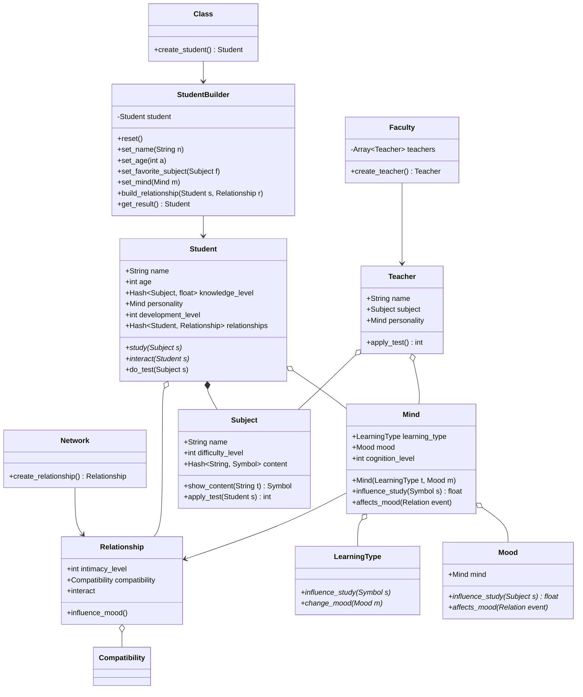

```mermaid
classDiagram
  Faculty --> Teacher
  Class --> StudentBuilder
  Network --> Relationship
  StudentBuilder --> Student
  Student o-- Mind
  Student *-- Subject
  Student o-- Relationship
  Mind o-- LearningType
  Mind o-- Mood
  Mind --> Relationship
  Relationship o-- Compatibility
  Teacher o-- Mind
  Teacher o-- Subject
  class Student{
    +String name
    +int age
    +Hash~Subject, float~ knowledge_level
    +Mind personality
    +int development_level
    +Hash~Student, Relationship~ relationships
    +study(Subject s)*
    +interact(Student s)*
    +do_test(Subject s)
  }
  class StudentBuilder{
    %%builder
    -Student student
    +reset()
    +set_name(String n)
    +set_age(int a)
    +set_favorite_subject(Subject f)
    +set_mind(Mind m)
    +build_relationship(Student s, Relationship r)
    +get_result() Student
  }
  class Class{
    %%creator
    +create_student() Student
  }
  class Mind{
    %%abstraction
    +LearningType learning_type
    +Mood mood
    +int cognition_level
    +Mind(LearningType t, Mood m)
    +influence_study(Symbol s) float
    +affects_mood(Relation event)
  }
  class LearningType{
    %%implementation
    +influence_study(Symbol s)*
    +change_mood(Mood m)*
  }
  class Mood{
    %%state
    +Mind mind
    +influence_study(Subject s) float*
    +affects_mood(Relation event)*
  }
  class Subject{
    +String name
    +int difficulty_level
    +Hash~String, Symbol~ content
    +show_content(String t) Symbol
    +apply_test(Student s) int
  }
  class Teacher{
    +String name
    +Subject subject
    +Mind personality
    +apply_test() int
  }
  class Faculty{
    %%creator
    -Array~Teacher~ teachers
    +create_teacher() Teacher
  }
  class Relationship{
    %%abstraction
    +int intimacy_level
    +Compatibility compatibility
    +interact
    +influence_mood()
  }
  class Network{
    %%creator
    +create_relationship() Relationship
  }
  class Compatibility{
    %%implementation
  }
```
