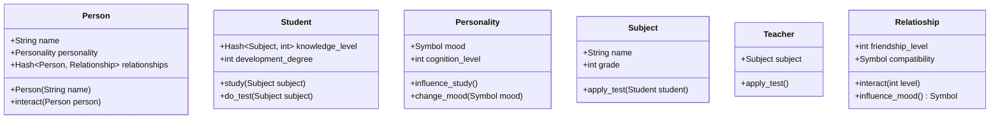

```mermaid
classDiagram
    class Person{
        +String name
        +Personality personality
        +Hash~Person, Relationship~ relationships
        +Person(String name)
        +interact(Person person)
    }
    class Student{
        +Hash~Subject, int~ knowledge_level
        +int development_degree
        +study(Subject subject)
        +do_test(Subject subject)
    }
    class Personality{
        +Symbol mood
        +int cognition_level
        +influence_study()
        +change_mood(Symbol mood)
    }
    class Subject{
        +String name
        +int grade
        +apply_test(Student student)
    }
    class Teacher{
        +Subject subject
        +apply_test()
    }
    class Relatioship{
        +int friendship_level
        +Symbol compatibility
        +interact(int level)
        +influence_mood() Symbol
    }
```